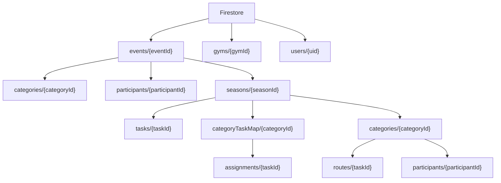

# FlashComp Data Spec

最終更新: 2026-03-03

## 概要
現行実装では、イベント配下に以下の構造を持ちます。

- イベント共通: `categories`, `participants`
- シーズン共通課題マスタ: `seasons/{seasonId}/tasks`
- カテゴリごとの課題採用: `seasons/{seasonId}/categoryTaskMap/{categoryId}/assignments`
- 互換レイヤー（既存採点・集計用）: `seasons/{seasonId}/categories/{categoryId}/routes`
- スコア: `seasons/{seasonId}/categories/{categoryId}/participants/{participantId}`

## 運用前提（GitHub Pages分離）

- フロントエンドは同一リポジトリ・同一 Firebase を前提に 3 配置運用する
  - `prod`: `https://vestige.github.io/FlashComp/`
  - `demo`: `https://vestige.github.io/FlashComp/demo/`
- `demo` は CI の `target_env`（`build:prod` / `build:demo`）で生成される
- `routes` は互換レイヤーとして残し、運用上の主要参照は `tasks` + `categoryTaskMap` を優先
- Firebase 設定は `VITE_FIREBASE_*` で注入し、将来は環境別 Project へ切り替え可能

## 用語（呼び名）
- `participants` = `climbers`（クライマー）
- `users` = `gymOwners`（運営ユーザー。role が `viewer` / `owner` / `admin`）
- `tasks` = シーズン共通の課題マスタ
- `categoryTaskMap/.../assignments` = カテゴリごとの課題セット（採用リスト）
- `routes` = 旧構造の互換データ（将来廃止予定）

## Firestore構造図

```mermaid
graph TD
  ROOT["Firestore"] --> EVENTS["events/{eventId}"]
  ROOT --> GYMS["gyms/{gymId}"]
  ROOT --> USERS["users/{uid}"]

  EVENTS --> ECAT["categories/{categoryId}"]
  EVENTS --> EPART["participants/{participantId}"]
  EVENTS --> SEASON["seasons/{seasonId}"]

  SEASON --> TASKS["tasks/{taskId}"]
  SEASON --> CTM["categoryTaskMap/{categoryId}"]
  CTM --> ASSIGN["assignments/{taskId}"]

  %% backward compatibility
  SEASON --> SCAT["categories/{categoryId}"]
  SCAT --> ROUTES["routes/{taskId}"]
  SCAT --> SCORES["participants/{participantId}"]
```

## ドキュメント定義

### 1) `events/{eventId}`
イベント本体。

主なフィールド（例）:
- `name`
- `gymId`
- `startDate`
- `endDate`

### 2) `events/{eventId}/categories/{categoryId}`
イベント共通カテゴリ。

主なフィールド（例）:
- `name`

### 3) `events/{eventId}/participants/{participantId}`
イベント共通クライマー。

主なフィールド（例）:
- `name`
- `memberNo`
- `age`
- `gender`
- `grade`
- `categoryId`
- `entrySeasonId`（seed由来）
- `participatingSeasonIds`（seed由来）

### 4) `events/{eventId}/seasons/{seasonId}`
シーズン本体。

主なフィールド（例）:
- `name`
- `startDate`
- `endDate`

### 5) `events/{eventId}/seasons/{seasonId}/tasks/{taskId}`
シーズン共通課題マスタ（30〜40件想定）。

主なフィールド（例）:
- `taskNo`
- `name`（例: `No.01`）
- `grade`
- `points`
- `isBonus`
- `isActive`

### 6) `events/{eventId}/seasons/{seasonId}/categoryTaskMap/{categoryId}/assignments/{taskId}`
カテゴリごとの課題採用定義（選択集合）。

主なフィールド（例）:
- `enabled`
- `taskNo`

### 7) `events/{eventId}/seasons/{seasonId}/categories/{categoryId}/routes/{taskId}`
互換レイヤー。旧実装の読み取り先。

主なフィールド（例）:
- `name`
- `taskNo`
- `grade`
- `points`
- `isBonus`

### 8) `events/{eventId}/seasons/{seasonId}/categories/{categoryId}/participants/{participantId}`
シーズン x カテゴリ x クライマーのスコア。

主なフィールド（例）:
- `scores`: `{ [taskNameOrTaskId]: boolean }`
- `updatedAt`
- `participated`（seed由来）
- `seasonStatus`（seed由来）

## Seasons配下の見方
- `tasks`: そのシーズンの「全課題」30-40件
- `categoryTaskMap/{categoryId}/assignments`: そのカテゴリで使う課題IDの集合
- `categories/{categoryId}/routes`: 旧採点ロジック互換のために同期している複製
- `categories/{categoryId}/participants`: クライマーの採点結果（scores）

## 現在の運用上の注意
- 課題の正規データは `tasks` + `categoryTaskMap` 側。
- 採点・ランキング・CSV は `tasks` + `assignments` を直接参照する。
- `routes` は旧データ互換レイヤーとして残っているが、新規同期は行っていない。

## Firestore読み取り最適化（第1弾: 2026-02-24）
### 対象
- `ScoreManager`（採点入口）
- `EventSummary`（公開ランキング）

### 実装内容
- `ScoreManager`
  - 変更前: `participants` を全件取得してクライアント側で `categoryId` フィルタ
  - 変更後: `where("categoryId", "==", selectedCategory)` でカテゴリ単位に取得
- `EventSummary`
  - 変更前: ランキング計算時、選択カテゴリに関係なく全カテゴリ分のスコアを走査
  - 変更後: `selectedCategoryId !== "all"` の場合は選択カテゴリのみでランキング計算

### 読み取り見積もり（概算）
- 記号:
  - `S`: 対象シーズン数
  - `C`: カテゴリ数
  - `Pc`: 1カテゴリあたりの参加者数
  - `P`: イベント全体参加者数
- `ScoreManager`:
  - 変更前: `P`
  - 変更後: `Pc`
- `EventSummary`（カテゴリ1つ選択時）:
  - 変更前: `S * C` 回のカテゴリ走査
  - 変更後: `S` 回のカテゴリ走査

## Firestore読み取り最適化（第2弾: 2026-03-03）
### 対象
- `ParticipantScoreDetail`
- `EventDataIO`

### 実装内容
- `ParticipantScoreDetail`
  - 変更前: `participants` をイベント全件取得
  - 変更後: 表示対象クライマーの `categoryId` で `where("categoryId", "==", ...)` 取得
- `EventDataIO`
  - `/events/{eventId}/data-io` は `EventClimbers` へのリダイレクトのみ（追加のFirestore読み取りなし）

### 読み取り見積もり（概算）
- 記号:
  - `P`: イベント全体参加者数
  - `Pc`: 対象カテゴリ参加者数
- `ParticipantScoreDetail` 初期読み取り:
  - 変更前: `P`
  - 変更後: `Pc`

## 画面導線仕様（2026-02-28時点）
運営側の導線は「入口を絞る」方針で以下に整理する。

- ダッシュボード（`/dashboard`）のイベント別入口:
  - `Create New Event` はダッシュボード内モーダル（ポップアップ）で起動
  - `設定` -> `/events/{eventId}/edit`
  - `クライマー` -> `/events/{eventId}/climbers`
  - `スコア` -> `/events/{eventId}/scores`（`live` のときのみ表示）
  - 主CTA（状態別）:
    - `upcoming`: `Event Settings`（`/events/{eventId}/edit`）
    - `live`: `Scores`（`/events/{eventId}/scores`）
    - `completed`: `Public Ranking`（`/score-summary/{eventId}`）
- 管理ページ共通（`EventClimbers` / `EventScores`）:
  - ページ上部に共通クイックナビ（`イベント設定` / `クライマー管理` / `スコア管理`）
  - 現在ページのみアクティブスタイルで表示
- 設定画面（`/events/{eventId}/edit`）内のナビ:
  - イベント基本情報の編集（イベント名・開始日・終了日）
  - イベント期間の更新時、既存シーズンが範囲外になる変更は保存不可（先にシーズン期間の調整が必要）
  - イベント削除は専用Confirmモーダルで確認してから実行する（ブラウザ標準confirmは使わない）
  - 設定進捗の可視化（シーズン / カテゴリ / 課題の3ステップ）
  - シーズンカードで、イベント期間外のシーズンを警告表示する
  - シーズン追加は `EditEvent` 内モーダルで実行（`＋ シーズン追加`）
  - シーズン期間はイベント期間内のみ登録可能
  - シーズンタブはカード一覧表示（期間・状態バッジ・編集/削除）
  - シーズンの `編集` は専用ページへ遷移（`/events/{eventId}/seasons/{seasonId}/edit`）
  - カテゴリ追加は `EditEvent` 内モーダルで実行（`＋ カテゴリ追加`）
  - `課題` タブはシーズン編集ページへの導線（直接編集は行わない）
  - `シーズン`
  - `カテゴリ`
  - `課題`
  - `戻る`（ダッシュボード）
- シーズン編集画面（`/events/{eventId}/seasons/{seasonId}/edit`）:
  - シーズン名・期間の更新
  - イベント開催期間を参照表示する
  - シーズン期間はイベント期間内のみ更新可能
  - シーズン課題の登録・編集・削除
  - カテゴリ採用課題の選択
  - シーズン削除（専用Confirmモーダル）
- クライマー画面（`/events/{eventId}/climbers`）:
  - クライマー登録・編集・削除
  - クライマー削除は専用Confirmモーダルで確認してから実行する
  - クライマーCSV出力/取り込み
  - 男女比CSV出力
  - `戻る`（ダッシュボード）
- スコア画面（`/events/{eventId}/scores`）:
  - サマリー表示（シーズン数、イベント開催期間、登録シーズン情報（名称・期間・登録課題数））
  - 採点対象の選択と採点画面遷移
  - シーズン選択は現在日時で`live`なシーズンを初期選択（存在しない場合は登録順1番目）
  - 採点対象選択（season/category）はURLクエリ（`scoreSeason` / `scoreCategory`）に保持し、戻り遷移時にも復元する
  - 選択カテゴリは「登録順（登録の早い順）」で表示
  - クライマー一覧に`memberNo`と`できた課題数`を表示
  - `戻る`（ダッシュボード）
- クライマー向けイベント一覧（`/score-summary`）:
  - 画面上部に `TOPへ戻る` 導線を配置する
  - イベントカードの主導線は `ランキングを見る` の1つに統一し、`/score-summary/{eventId}/ranking?from=portal` へ遷移する
  - フィルターは `Dashboard` と同系UIで、`検索` + `Live/Past` + `ジム選択` + `リセット` を提供する

## ユーザーシナリオ（TODO反映）
### 目的
- 運営側の負担を減らす（点数設定、集計、公開）
- クライマーのモチベーションを上げる（すぐに結果が見られる）

### システム管理者
- ジムのオーナー登録
- ジムの登録・削除・編集
- すべてのジムのイベント編集や採点を実施

### 運営側（ジムオーナー）
#### イベント開催前
- イベントの登録・削除・編集（イベント名、シーズン数、カテゴリ）
- シーズンの登録・削除・編集（シーズン名）
- シーズンごとの課題の登録・削除・編集（番号、級、点数）
- カテゴリの登録・削除・編集（カテゴリ名）

#### イベント開催後
- クライマー登録（名前、会員番号、年齢、性別、参加カテゴリ）
- CSV形式でのデータ入出力（参加情報、男女比率、シーズン別順位など）
- クライマーごとの得点入力（完登課題をチェック）

### クライマー側
- スマートフォンで閲覧
- ログイン不要
- 自分のスコア確認
- カテゴリごとの集計結果確認

## 認証試験手順（Googleログイン・最小アカウント運用）
Google運用では、同一Googleアカウントで `users/{uid}` を編集して権限を切り替える方式を採用する。
管理画面の認証は `Login` の Google Sign-In のみで、メール/パスワード認証は運用外とする。

### 前提
- 対象はステージング（本番データ不使用）で実施する
- Firebase Authentication は **Google のみ有効化**（Email/Password は運用外）
- 対象環境の `Authorized domains` と OAuth リダイレクト URI が一致している
- 検証用アカウントで Firebase Console から `users/{uid}` を編集可能
- 切り替え前の `users/{uid}`（`role` / `gymIds`）を記録しておく

### ロール別ケース
#### ケース1: `admin`（`role: "admin"`, `gymIds: ["*"]`）
1. 該当アカウントで `Login` し、Google認証で入室できること
2. `/system-admin` に入れること
3. `gyms` の作成・更新・削除が行えること
4. `/events/.../scores` など管理画面ルートが閲覧可能で、管理操作が成功すること
5. `/dashboard` と公開側 `/score-summary` も問題なく閲覧できること

#### ケース2: `owner`（`role: "owner"`, `gymIds: ["gym-shibuya"]`）
1. 該当アカウントで `Login` できること
2. `/system-admin` は開けない（管理画面権限に応じた拒否）
3. 担当ジムのイベントのみ編集可能
4. 非担当ジムのイベント編集・削除は `permission-denied` で拒否されること
5. `/dashboard` は閲覧可能

#### ケース3: `viewer`（`role: "viewer"`, `gymIds: []`）
1. 該当アカウントで `Login` できること
2. `/dashboard` は閲覧できること
3. イベント作成/更新（管理側の書き込み）で拒否されること

#### ケース4: 非許可
1. `users/{uid}` が未作成、または `role` 未設定の状態で `Login` すること
2. 初回ログイン後に `users/{uid}` が `role: "viewer"` として自動作成されること
3. 管理画面系 API は `permission-denied` で拒否されること
4. `/system-admin` は開けないが、公開クライマー系 `/score-summary` は引き続きログイン不要で閲覧できること

### 補足確認
- 失敗系は必ず「ログイン自体」ではなく、`permission-denied` の内容を見て運用者向けメッセージへ統一されること
- owner / admin の誤判定が出た場合は `users/{uid}` のロール復旧（必要なら `admin`）から再確認
- リリース前には本番を想定したアカウントを最低1回通し実行する
